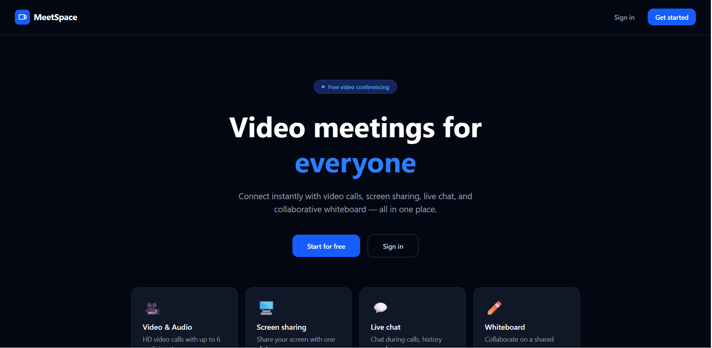
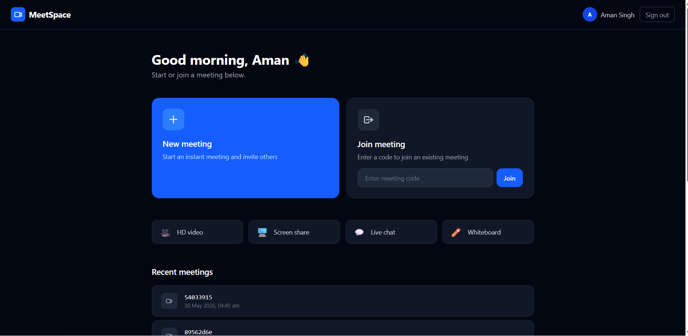
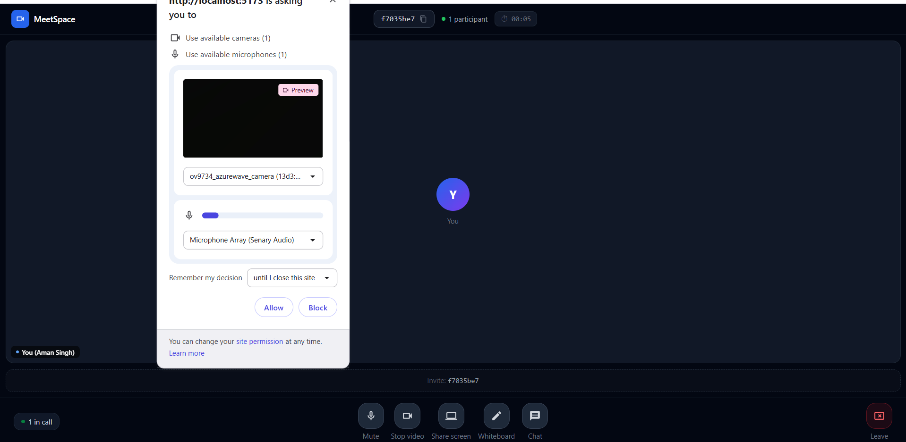
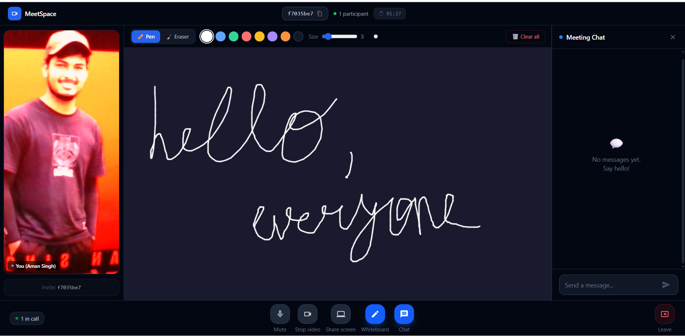

# MeetSpace 🚀

A full-stack real-time video conferencing platform built using the MERN stack, WebRTC, and Socket.IO. MeetSpace enables users to create and join virtual meeting rooms with video/audio communication, real-time chat, collaborative whiteboard functionality, and screen sharing.

🔗 Live Demo: https://meet-space-sepia.vercel.app

🔗 Backend API: https://meetspace-backend-s3uy.onrender.com

## ✨ Features

* 🔐 JWT-based Authentication
* 🎥 Real-Time Video Conferencing using WebRTC
* 💬 Live Chat with Socket.IO
* 🖥️ Screen Sharing
* 🎨 Collaborative Whiteboard
* 👥 Multi-Participant Meeting Rooms
* 📋 Copy & Share Meeting Codes
* 📱 Responsive User Interface

## 📸 Screenshots

### Landing Page



### Home Page



### Meeting Room



### Collaborative Whiteboard



## 🛠️ Tech Stack

### Frontend

* React.js
* Vite
* Socket.IO Client
* Tailwind CSS
* Axios

### Backend

* Node.js
* Express.js
* Socket.IO
* JWT Authentication
* MongoDB & Mongoose

### Real-Time Communication

* WebRTC
* Socket.IO

## 📂 Project Structure

```bash
MeetSpace/
├── backend/
│   ├── src/
│   ├── package.json
│   └── .env
│
├── frontend/
│   ├── src/
│   ├── public/
│   ├── package.json
│   └── .env
│
└── README.md
```

## ⚙️ Installation

### Clone Repository

```bash
git clone https://github.com/Aman-1508/MeetSpace.git
cd MeetSpace
```

### Backend Setup

```bash
cd backend
npm install
```

Create a `.env` file:

```env
PORT=5000
MONGO_URI=your_mongodb_connection_string
JWT_SECRET=your_jwt_secret
CLIENT_URL=http://localhost:5173
```

Start backend:

```bash
npm run dev
```

### Frontend Setup

```bash
cd frontend
npm install
```

Create a `.env` file:

```env
VITE_SERVER_URL=http://localhost:5000
VITE_API_URL=http://localhost:5000/api/v1
```

Start frontend:

```bash
npm run dev
```

## 🚀 Usage

1. Register or login.
2. Create a new meeting room or join an existing room using the meeting code.
3. Start video conferencing with other participants.
4. Use live chat for communication.
5. Share your screen during meetings.
6. Collaborate using the shared whiteboard.

## 🔥 Key Highlights

* Peer-to-peer media streaming with WebRTC.
* Real-time event synchronization using Socket.IO.
* Collaborative whiteboard with live drawing updates.
* Secure user authentication using JWT.
* Responsive and modern meeting interface.

## 📌 Future Improvements

* Meeting recording
* Raise hand functionality
* Participant roles (Host/Admin)
* Whiteboard state persistence
* File sharing during meetings
* Deployment on cloud platforms

## 👨‍💻 Author

**Aman Singh**

MCA, NIT Jamshedpur

GitHub: https://github.com/Aman-1508
